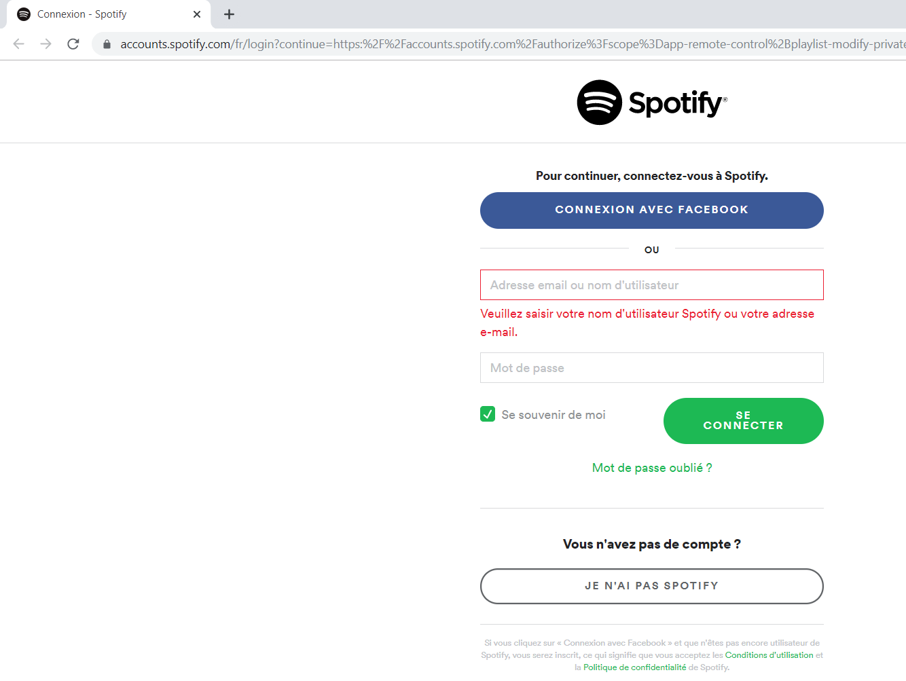
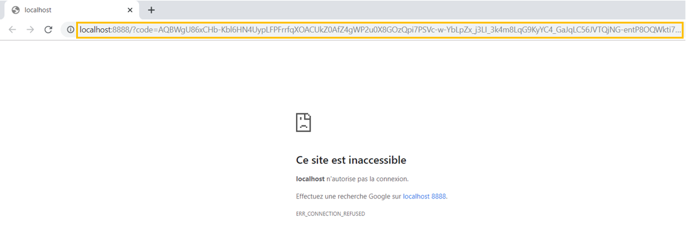
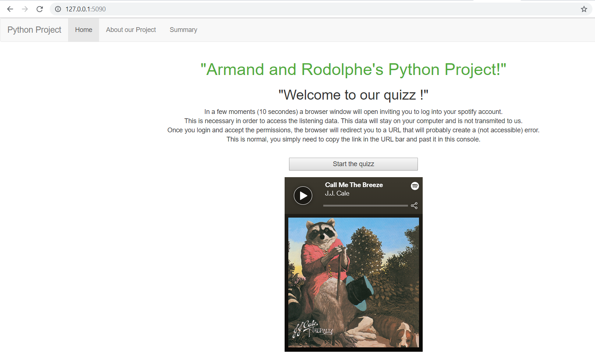

## Introduction to Python & Introduction to DBMS 
_Rodolphe de la Bastie_ <br>
_Armand Kouyoumdjian_ <br>

This document is here to help you run the python code. 

#### Setting Things Up
Before running any python script with all its functionalities there are a few things to do. You need to have:
- Python installed on your computer 
- Git installed on your computer
- A Spotify account

Now follow these steps:
-	Extract the zip file somewhere on your computer.
-	Open a command line (cmd on windows) in the folder of the extracted file.
-	Our python code uses some libraries that do not come with the default python installation. Hence you need to install it manually with pip install. You need to be connected to the internet. <br>
The “requirements.txt” was generated with pipreqs and indicates all the packages and their versions that need to be installed before running the code. We buit a Flask python app so you will of course need to install Flask. <br>
We have encountered a anomalie when installing the Spotipy package with the default pip install command. In order to have an app that does not crash, you need to install / update the Spotipy package directly with it's github web adresse. This is why you need to have Git installed on your computer.
To install Spotipy run the following command:
```python
pip install git+https://github.com/plamere/spotipy.git --upgrade
```
	
#### Running The Code
You are now ready to run the code. 
-	To launch the quiz you simply need to run the Flask_page.py script in the console:
```python
python Flask_page.py
```
- The first message that you will see in the console is the explanation to connect to your Spotify account.
```shell
WELCOME TO OUR SPOTIFY QUIZ APP
In a few moments (10 secondes) a browser window will open inviting you to log into your spotify account. This is necessary in order to access the listening data. This data will stay on your computer and is not transmited to us. 
```
- The following Spotify login page opens, log in and accepts the authorizations. (of course our python code does not send any of your data)

- Once you login and accept the permissions, the browser will redirect you to a URL that will probably create a (not accessible) error. This is normal, you simply need to copy the link in the URL bar and past it back in the console. 

- If everything goes as planned, a local Flask server will start. Copy/Paste the server address to any web browser. <br>
You should land on the Flask web app Welcome Page:

